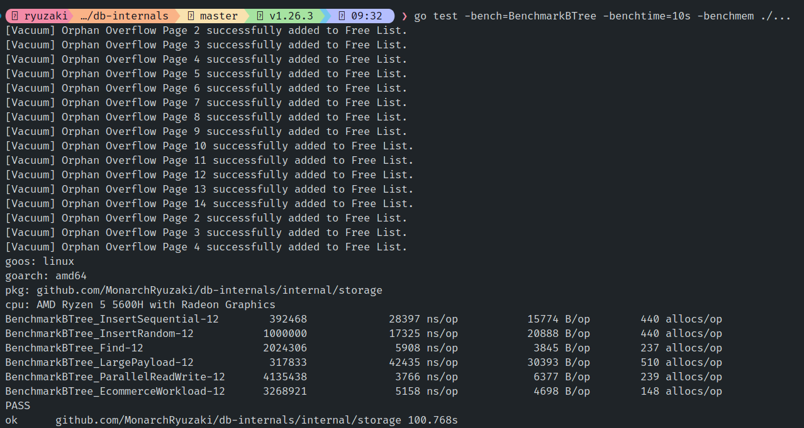
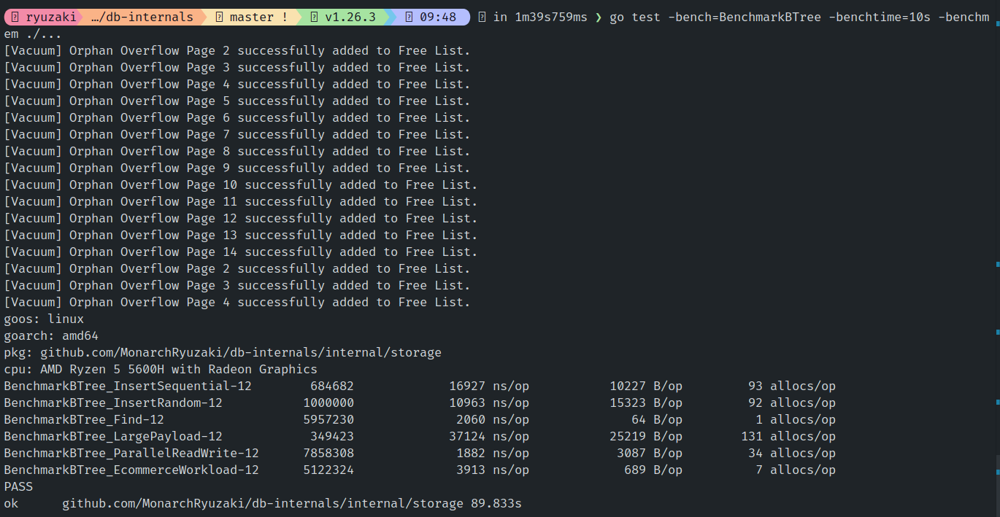

# Optimization Case Study: Zero-Copy Deserialization

During the benchmarking phase of the Storage Engine, we observed surprisingly high memory allocations. A standard `Find` operation was triggering **~237 allocations per operation (allocs/op)**, and `Insert` was triggering **~440 allocs/op**.

While the engine was already fast, these allocations were forcing Go's Garbage Collector (GC) to work overtime, artificially capping our throughput.

## The Problem: Deep Copying & Heap Escape

The issue originated in the cell deserialization logic used to scan B-Tree pages. The original `DeserializeKVCell` function looked like this:

```go
func DeserializeKVCell(data []byte) *KVCell {
    k := &KVCell{}                           // Allocation 1: Pointer normally escapes to Heap
    
    // ... (calculate keyLen and valLen) ...

    k.Key = make([]byte, keyLen)             // Allocation 2: Deep copy buffer
    k.Value = make([]byte, valLen)           // Allocation 3: Deep copy buffer
    
    copy(k.Key, data[5 : 5+keyLen])
    copy(k.Value, data[5+keyLen : 5+keyLen+valLen])
    
    return k
}
```

Because B-Tree pages maintain their cells in a linear, unsorted array, searching for a key required a linear scan of the page. An average leaf page in our tests contained ~80 cells. 
Every time a `Find` or `Insert` operation traversed a page, it called this function 80 times. `80 cells * 3 allocations = 240 allocations`.

We were asking the operating system to allocate hundreds of tiny, temporary memory blocks just to *look* at the data, which were immediately discarded once the target key was found. This created massive Garbage Collection pressure.



## The Fix: Zero-Copy Slicing

To solve this, we implemented **Zero-Copy Deserialization**. We changed the function to stop making deep copies, completely removing the `make()` calls:

```go
func DeserializeKVCell(data []byte) *KVCell {
    k := &KVCell{} 
    
    // ... (calculate keyLen and valLen) ...

    // Slice the existing array instead of allocating new memory!
    k.Key = data[5 : 5+keyLen]  
    k.Value = data[5+keyLen : 5+keyLen+valLen]
    
    return k
}
```

## Why it Worked: Escape Analysis Magic

You might notice that we still returned a pointer (`k := &KVCell{}`). Normally, returning a pointer forces an object onto the slow, garbage-collected Heap. However, our allocations still dropped to 0! This optimization relies on two core concepts in Go's memory model:

1. **Slice Headers (Zero-Copy):** In Go, a slice (`[]byte`) is just a 24-byte header containing a pointer to an underlying array, a length, and a capacity. By doing `data[start:end]`, we aren't copying the physical bytes; we are simply creating a new 24-byte header that points to a specific "window" inside the pre-existing 4KB Page array in our Buffer Pool. 
2. **Escape Analysis:** Because we removed the `make([]byte, n)` calls (which strictly require Heap allocation because their size is dynamic), the only pointer left was `&KVCell{}`. The Go compiler runs an "Escape Analysis" pass and notices that the caller (`Find`) only reads the pointer temporarily inside a loop and immediately discards it. The pointer never "escapes" the caller's scope. Therefore, the Go compiler performs a brilliant optimization: **it secretly places the `KVCell` struct on the caller's Stack Frame instead of the Heap**.

The raw bytes remain safely on the Heap (in the Buffer Pool), the slice headers point to them, and the struct holding those headers lives entirely on the fast, GC-free Stack.

## The Results

By utilizing the bytes already cached in our Buffer Manager and letting Escape Analysis do its job, the results were staggering:

- **`Find` Allocations:** Dropped from **237 allocs/op** to **1 alloc/op** (the single allocation being a string format in the test file).
- **`Find` Latency:** Dropped from `~5,900 ns` to `~2,000 ns` (A 3x speedup).
- **Concurrent Throughput:** The `ParallelReadWrite` benchmark jumped to over **530,000 operations per second** across multiple cores, entirely bottlenecked by raw CPU speed rather than memory allocation locks.

